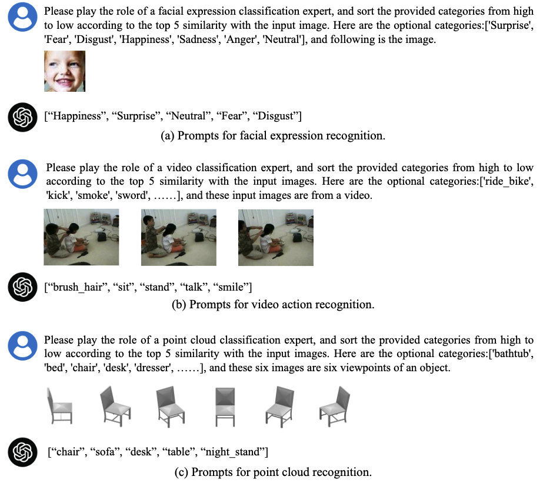

<div align="center">


<h2 align="center"> GPT4Vis: What Can GPT-4 Do for Zero-shot Visual Recognition?</h2>


</div>

***
This work delves into an essential, yet must-know baseline in light of the latest advancements in Generative Artificial Intelligence (GenAI): the utilization of GPT-4 for visual understanding. We center on the evaluation of GPT-4's linguistic and visual capabilities in zero-shot visual recognition tasks. To ensure a comprehensive evaluation, we have conducted experiments across three modalities—images, videos, and point clouds—spanning a total of 16 popular academic benchmark. 

<div align="center">

</div>


## News
- [x] We shared all results in the [**GPT4V_ZS_Results**](./GPT4V_ZS_Results) folder! 
😏 *Additionally, we offer a reference data point: the total cost of invoking the GPT-4V API to test across all datasets once is estimated to be around 🔥$4000💰, intended to assist readers in their planning.* 


## Overview

<!-- <h3 style="text-align: center;">Zero-shot visual recognition leveraging GPT-4's linguistic and visual capabilities.</h3> -->


<div align="center">
An overview of 16 evaluated popular benchmark datasets, comprising images, videos, and point clouds.


Zero-shot visual recognition leveraging GPT-4's linguistic and visual capabilities.

</div>


## Generated Descriptions from GPT-4

<div align="center">

</div>

- We have pre-generated descriptive sentences for all the categories across the datasets, which you can find in the [**GPT_generated_prompts**](./GPT4_generated_prompts) folder. Enjoy exploring!

- We've also provided the example script to help you generate descriptions using GPT-4. For guidance on this, please refer to the [generate_prompt.py](./generate_prompt.py) file. Happy coding! Please refer to the [**config**](./config) folder for detailed information on all datasets used in our project. 
- Execute the following command to generate descriptions with GPT-4.
  ```sh
  # To run the script for specific dataset, simply update the following line with the name of the dataset you're working with: 
  # dataset_name = ["Dataset Name Here"]   # e.g., dtd
  python generate_prompt.py
  ```

## GPT-4V(ision) for Visual Recognition
<div align="center">

</div>

- We share an example script that demonstrates how to use the GPT-4V API for zero-shot predictions on the DTD dataset. Please refer to the [GPT4V_ZS.py](./GPT4V_ZS.py) file for a step-by-step guide on implementing this. We hope it helps you get started with ease!

  ```sh
  # GPT4V zero-shot recognition script. 
  # dataset_name = ["Dataset Name Here"]   # e.g., dtd
  python GPT4V_ZS.py
  ```

- All results are available in the [**GPT4V_ZS_Results**](./GPT4V_ZS_Results) folder! In addition, we've provided th corresponding ground truths ([**annotations**](./annotations) folder) to help readers in replicating the results.

<div align="center">

| DTD |  EuroSAT |  SUN397 |  RAF-DB |  Caltech101  | ImageNet-1K | FGVC-Aircraft | Flower102 |
|:---:|:---:|:---:|:---:|:---:|:---:|:---:|:---:|
| [57.7](./GPT4V_ZS_Results/dtd.json)  | [46.8](./GPT4V_ZS_Results/eurosat.json) |  [59.2](./GPT4V_ZS_Results/sun397.json) |  [68.7](./GPT4V_ZS_Results/rafdb.json) | [93.7](./GPT4V_ZS_Results/caltech101.json)  |  [63.1](./GPT4V_ZS_Results/imagenet.json) | [56.6](./GPT4V_ZS_Results/aircraft.json) |  [69.1](./GPT4V_ZS_Results/flower102.json) | 
|  [Label](./annotations/dtd_gt.json)  |  [Label](./annotations/eurosat_gt.json)   | [Label](./annotations/sun397_gt.json)    | [Label](./annotations/rafdb_gt.json)    |  [Label](./annotations/caltech101_gt.json)  | [Label](./annotations/imagenet_gt.json)  |  [Label](./annotations/aircraft_gt.json)   |  [Label](./annotations/flower102_gt.json)    |
   


| Stanford Cars | Food101| Oxford Pets | UCF-101 | HMDB-51 | Kinetics-400 | ModelNet-10 |
|:---:|:---:|:---:|:---:|:---:|:---:|:---:|
[62.7](./GPT4V_ZS_Results/car.json)  |  [86.2](./GPT4V_ZS_Results/food101.json) | [90.8](./GPT4V_ZS_Results/pets.json) | [83.7](./GPT4V_ZS_Results/ucf_8frame.json) | [58.8](./GPT4V_ZS_Results/hmdb_8frame.json) | [58.8](./GPT4V_ZS_Results/k400.json) | [66.9](./GPT4V_ZS_Results/modelnet10_front.json) |
|  [Label](./annotations/stanford_cars_gt.json)   |  [Label](./annotations/food_gt.json)   | [Label](./annotations/pets_gt.json)    | [Label](./annotations/ucf_gt.json)   |  [Label](./annotations/hmdb_gt.json)  |  [Label](./annotations/k400_gt.json)  |  [Label](./annotations/modelnet10_gt.json)   |

</div>

- With the provided prediction and annotation files, you can reproduce our top-1/top-5 accuracy results with the [calculate_acc.py](./calculate_acc.py) script.

  ```sh
  # pred_json_path = 'GPT4V_ZS_Results/imagenet.json'
  # gt_json_path = 'annotations/imagenet_gt.json'
  python calculate_acc.py
  ```

## Requirement
For guidance on setting up and running the GPT-4 API, we recommend checking out the official OpenAI Quickstart documentation available at: [OpenAI Quickstart Guide](https://platform.openai.com/docs/quickstart).


