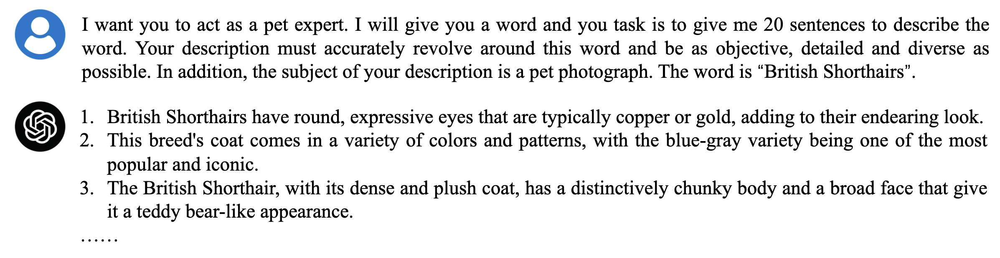

<div align="center">

<h2> GPT4Vis: What Can GPT-4 Do for Zero-shot Visual Recognition? </h2>

[](https://arxiv.org/abs/2311.15732)
[](https://zhuanlan.zhihu.com/p/669758735)

[Wenhao Wu](https://whwu95.github.io/)<sup>1,2</sup>, [Huanjin Yao](https://openreview.net/profile?id=~Huanjin_Yao1)<sup>2,3</sup>, [Mengxi Zhang](https://scholar.google.com/citations?user=73tAoEAAAAAJ&hl=en)<sup>2,4</sup>, [Yuxin Song](https://openreview.net/profile?id=~YuXin_Song1)<sup>2</sup>, [Wanli Ouyang](https://wlouyang.github.io/)<sup>5</sup>, [Jingdong Wang](https://jingdongwang2017.github.io/)<sup>2</sup>

 
<sup>1</sup>[The University of Sydney](https://www.sydney.edu.au/), <sup>2</sup>[Baidu](https://vis.baidu.com/#/), <sup>3</sup>[Tsinghua University](https://www.tsinghua.edu.cn/en/), <sup>4</sup>[Tianjin University](https://www.tju.edu.cn/english/index.htm/), <sup>5</sup>[The Chinese University of Hong Kong](https://www.cuhk.edu.hk/english/#)


</div>

***
This work delves into an essential, yet must-know baseline in light of the latest advancements in Generative Artificial Intelligence (GenAI): the utilization of GPT-4 for visual understanding. We center on the evaluation of GPT-4's linguistic and visual capabilities in zero-shot visual recognition tasks. To ensure a comprehensive evaluation, we have conducted experiments across three modalities—images, videos, and point clouds—spanning a total of 16 popular academic benchmark. 

<div align="center">

</div>

<details><summary>📣 I also have other cross-modal projects that may interest you ✨. </summary><p>


> [**Transferring Vision-Language Models for Visual Recognition: A Classifier Perspective**](https://link.springer.com/article/10.1007/s11263-023-01876-w)<br>
> Accepted by AAAI 2023 & IJCV 2023 | [[Text4Vis Code]](https://github.com/whwu95/Text4Vis)<br>
> Wenhao Wu, Zhun Sun, Yuxin Song, Jingdong Wang, Wanli Ouyang


> [**Bidirectional Cross-Modal Knowledge Exploration for Video Recognition with Pre-trained Vision-Language Models**](https://arxiv.org/abs/2301.00182)<br>
> Accepted by CVPR 2023 | [[BIKE Code]](https://github.com/whwu95/BIKE)<br>
> Wenhao Wu, Xiaohan Wang, Haipeng Luo, Jingdong Wang, Yi Yang, Wanli Ouyang

> [**Cap4Video: What Can Auxiliary Captions Do for Text-Video Retrieval?**](https://arxiv.org/abs/2301.00184)<br>
> Accepted by CVPR 2023 as 🌟Highlight🌟 | [[Cap4Video Code]](https://github.com/whwu95/Cap4Video)<br>
> Wenhao Wu, Haipeng Luo, Bo Fang, Jingdong Wang, Wanli Ouyang

</p></details>


## News
- [x] **[Nov 28, 2023]** We release our [report](https://arxiv.org/abs/2311.15732) in Arxiv.
- [x] **[Nov 27, 2023]** Our prompts have been released. Thanks for your star 😝.


## Overview

<!-- <h3 style="text-align: center;">Zero-shot visual recognition leveraging GPT-4's linguistic and visual capabilities.</h3> -->


<div align="center">
An overview of 16 evaluated popular benchmark datasets, comprising images, videos, and point clouds.


Zero-shot visual recognition leveraging GPT-4's linguistic and visual capabilities.

</div>


## Generated Descriptions from GPT-4

<div align="center">

</div>

- We have pre-generated descriptive sentences for all the categories across the datasets, which you can find in the [**GPT_generated_prompts**](https://github.com/whwu95/GPT4Vis/tree/main/GPT4_generated_prompts) folder. Enjoy exploring!

- We've also provided the example script to help you generate descriptions using GPT-4. For guidance on this, please refer to the [generate_prompt.py](https://github.com/whwu95/GPT4Vis/blob/main/generate_prompt.py) file. Happy coding! Please refer to the [**config**](https://github.com/whwu95/GPT4Vis/tree/main/config) folder for detailed information on all datasets used in our project. 
- Execute the following command to generate descriptions with GPT-4.
  ```sh
  # To run the script for specific dataset, simply update the following line with the name of the dataset you're working with: 
  # dataset_name = ["Dataset Name Here"]   # e.g., dtd
  python generate_prompt.py
  ```

## GPT-4V(ision) for Visual Recognition
<div align="center">

</div>

- We share an example script that demonstrates how to use the GPT-4V API for zero-shot predictions on the DTD dataset. Please refer to the [GPT4V_ZS.py](https://github.com/whwu95/GPT4Vis/blob/main/GPT4V_ZS.py) file for a step-by-step guide on implementing this. We hope it helps you get started with ease!

  ```sh
  # GPT4V zero-shot recognition script. 
  # dataset_name = ["Dataset Name Here"]   # e.g., dtd
  python GPT4V_ZS.py

  # We also provide a script for batch testing with each request (larger batch sizes may lead to instability).
  python GPT4V_ZS_batch.py
  ```

## Requirement
For guidance on setting up and running the GPT-4 API, we recommend checking out the official OpenAI Quickstart documentation available at: [OpenAI Quickstart Guide](https://platform.openai.com/docs/quickstart).


<a name="bibtex"></a>
## 📌 BibTeX & Citation

If you use our code in your research or wish to refer to the results, please star 🌟 this repo and use the following BibTeX 📑 entry.

```bibtex
@article{GPT4Vis,
  title={GPT4Vis: What Can GPT-4 Do for Zero-shot Visual Recognition?},
  author={Wu, Wenhao and Yao, Huanjin and Zhang, Mengxi and Song, Yuxin and Ouyang, Wanli and Wang, Jingdong},
  booktitle={arXiv preprint arXiv:2311.15732},
  year={2023}
}
```

<a name="acknowledgment"></a>
## 🎗️ Acknowledgement
This evaluation is built on the excellent works:
- [CLIP](https://github.com/openai/CLIP): Learning Transferable Visual Models From Natural Language Supervision
- [GPT-4](https://platform.openai.com/docs/guides/vision)
- [Text4Vis](https://github.com/whwu95/Text4Vis): Transferring Vision-Language Models for Visual Recognition: A Classifier Perspective
  
We extend our sincere gratitude to these contributors.


## 👫 Contact
For any questions, please feel free to file an issue.
